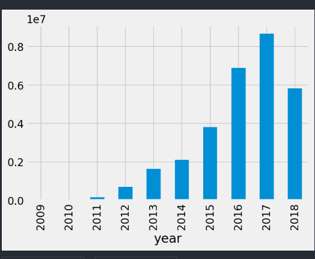
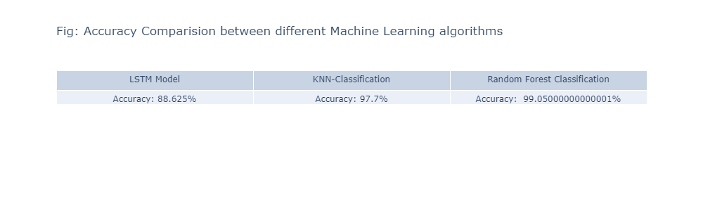

## PROBLEM STATEMENT
Machine Learning processing is a logical continuity to the use of the blockchain database.
You will collect data, store it on a decentralized system, and machine learning algorithms will
process.
There is an immense probability that blockchain and machine learning could be combined, as
we can use machine learning and blockchain in various fields and areas but one example can
be to enhance security. as machine learning requires a lot of data and blockchain is like a ledger
of data, the amalgamation of the two technologies can bring in immense opportunities in the
growing technological era.Both blockchains and machine learning are new technologies that
have emerged in the last decade that have far-reaching consequences for all spheres of human
activity.The merger will be a game changer for the self-driving research as it can help create
a marketplace and also the finance and insurance industries have a lot to gain as together,
they can be used to design tools to identify and prevent fraud. Hence the amalgamation of
Blockchain and machine learning is evolving and, in the future, could be the next big thing;
we just have to wait and see how technologies unravel their mysteries

## PROPOSED SOLUTION
Proposed Solutions are described as follows:
• Analyse the Data-set and visualizing it
• Using different machine learning approaches for prediction using bitcoin-blockchain
big-query data-set
• Comparison between different ML-approaches

  
